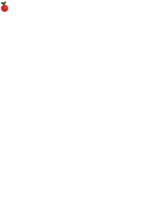

# Lingon - The Sour Game Engine
Lingon is a minimalistic game engine aimed at Game Jams, made to be compatible
with the [sylt programming language](https://github.com/fredthedino/sylt-lang/).

*NOTE: Under heavy development*

## Getting started
There are two ways this engine can be used:
1. Depend on this repository in your Cargo.toml and setup a minimal project (see main.rs) 
2. Clone this repository and write the game in the engine

## Some nice features
 - Sylt integration, for fast prototyping
 - Particles. Lots and lots of particles
 - Fast build times. Dependencies are kept to a minimum to make it quick to get started
 - Written in Rust
